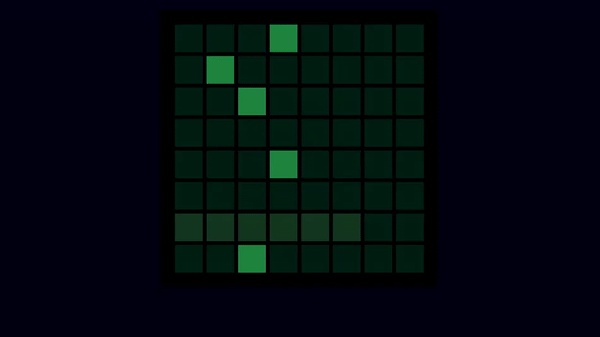

# Dance Dance Revolution clone for the PewPew console

Łukasz Langa did some work in 2022 on a PewPew emulator in the browser with the
help of [PyScript](https://pyscript.net/).

Using the example of a minimalistic DDR like with a resolution of only 8x8
pixels!

This is my attempt to run the game in an actual PyScript environment in 2023.

You can try it here: <https://bjoernschilberg.github.io/melly-ddr/>

## Links

- https://en.wikipedia.org/wiki/Dance_Dance_Revolution
- https://twitter.com/llanga/status/1559249954262204417
- https://mellyn.itch.io/dd-rez
- https://mellyn.games/ddr/
- https://docs.pyscript.net/latest/reference/index.html
